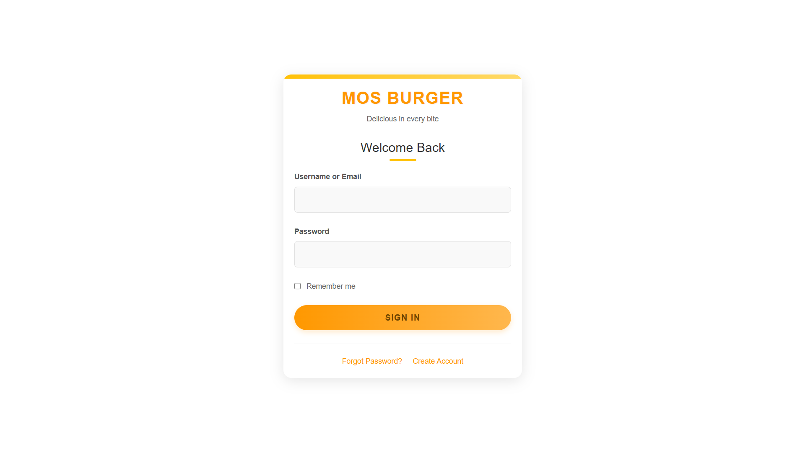
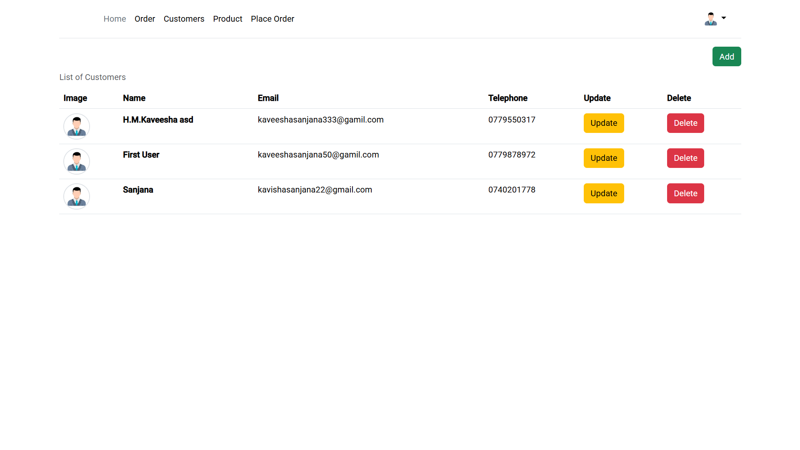
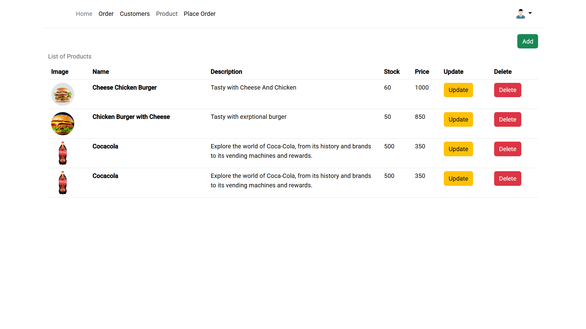
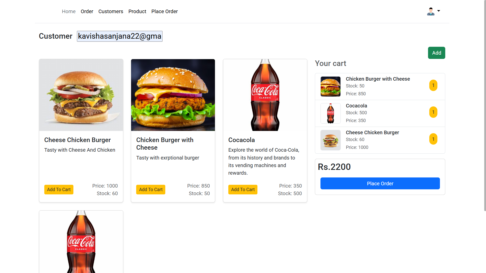

# 🍔 MOS Burger - POS System

A simple and modern Point of Sale (POS) system designed for burger restaurants. Built with **Angular** (frontend) and **Spring Boot** (backend), this system includes customer, product, order, and cart management with full CRUD functionality.

---

## 🔑 Features

- ✅ Secure login with JWT authentication
- 🏠 Home view
- 👥 Customer management (CRUD)
- 🍔 Product management (CRUD)
- 🛒 Cart functionality with live order building
- 📦 Order management with placement functionality
- 📧 Email notification upon order placement
- Responsive and user-friendly UI

---

## 🧱 Tech Stack

### Frontend
- Angular
- JWT Authentication
- Bootstrap
  
### Backend
- Spring Boot
- Spring Security with JWT
- Spring Data JPA with Hibernate
- MySQL

---
## 🚀 Getting Started

### 🔧 Backend Setup

1. Navigate to the backend directory:
   ```bash
   cd backend
   ```

2. Configure the `application.properties` file with your MySQL database credentials.

3. Run the Spring Boot application:
   ```bash
   ./mvnw spring-boot:run
   ```

### 💻 Frontend Setup

1. Navigate to the frontend directory:
   ```bash
   cd frontend
   ```

2. Install dependencies:
   ```bash
   npm install
   ```

3. Run the Angular application:
   ```bash
   ng serve
   ```

---

## 📸 Screenshots

### 🔐 Login


### 🏠 Home


### 👥 Customers


### 🍔 Products


### 🛒 Cart


### 📦 Orders


---

## 📬 Order Email Notification

When a customer places an order, the system automatically sends an order confirmation email to the configured recipient (admin or customer).

---

## 🔒 Authentication

- JWT token-based login and session handling
- Angular HTTP Interceptor for token attachment
- Spring Security-based role and access control

---

## 🤝 Contribution

Contributions are welcome! Fork the repository, create a feature branch, and submit a pull request.

---

## 🧑‍💻 Developed by

**H.M. Kaveesha Sanjana**

---

## 📄 License

This project is licensed under the [MIT License](https://opensource.org/licenses/MIT).
